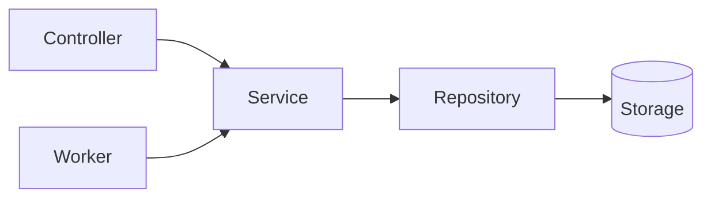
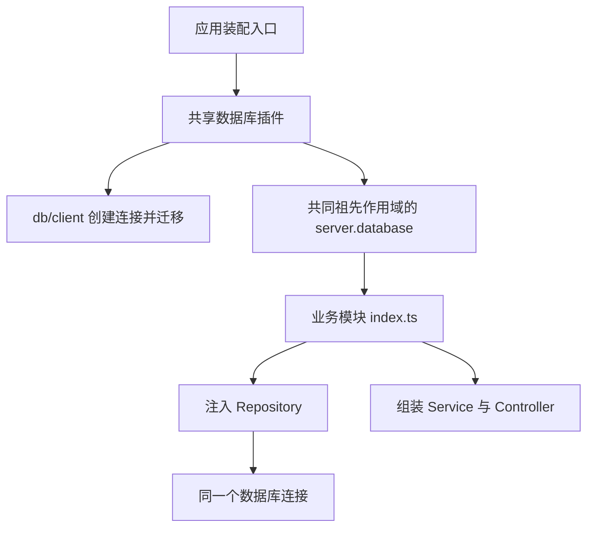

# 代码开发规范

本文是仓库级开发约束，适用于 `apps/` 和 `packages/` 中的手写代码。目标是保持代码轻量、可读、高内聚、低耦合，让目录直接表达职责与业务边界。

新增代码必须遵守本文；存量代码在相应重构范围内按本规范整理，不借机扩大任务。各级 `AGENTS.md` 仍适用；涉及本文的目录与抽象规则，以本文为准，其他专项要求继续遵守。受保护目录的修改要求见第 7 节。

## 1. 基本原则

- 优先满足当前已存在的业务需求，不为假设中的扩展引入接口、基类、工厂、注册中心或多层转发。
- **300 行是提示检查代码是否臃肿的参考阈值，不是文件长度上限，也不是强制拆分标准。** 超过该阈值时检查职责、可读性与依赖；职责内聚、阅读顺畅的文件可以保持完整，无需例外审批。
- 拆分必须带来明确收益，例如隔离独立业务能力、明确资源所有权或减少耦合。禁止仅为减少行数拆文件、拆模块、增加转发层或把复杂度搬入 utils。文件长度不得作为 lint、CI、代码审查或验收的单独失败条件，短文件也不自动代表良好设计。
- 单处使用的函数、类型、常量优先留在所属实现文件内；确有复用时再提取，并明确归属。
- 依赖方向必须清晰，禁止循环依赖、跨模块访问内部状态和通过全局服务定位器隐式获取业务依赖。
- 现有函数能够完成职责时，不为统一形式强制改成 Class；已有 Class 也不需要配套创建 interface。
- “必须”“禁止”表示强制约束；“优先”表示默认选择，偏离时须说明具体职责或契约上的理由。不得用目录整齐、测试方便或未来扩展代替设计依据。
- **结构改动必须有明确收益，行为不变必须有验证证据。** 文件更少、行数更短、目录合规或现有测试全部通过，都不能单独证明重构成功。

## 2. 后端业务模块

### 2.1 目录白名单

`apps/server/src/modules/<module>/` 的直接子项只允许以下内容；`<module>` 使用表达业务能力的 kebab-case 名称，文件前缀必须与目录名一致。

```text
apps/server/src/modules/<module>/
├── index.ts
├── <module>.controller.ts
├── <module>.service.ts
├── <module>.repository.ts
├── <module>.dto.ts
├── <module>.utils.ts
└── workers/
    └── <task>.worker.ts
```

- `index.ts` 是每个业务模块的必需入口；其他角色文件每种最多一个，按实际需要创建。没有传输入口就不创建 controller，没有数据访问就不创建 repository，禁止空壳占位。
- `index.ts` 是唯一模块装配入口，负责默认导出 Fastify 插件、组装实例及注册生命周期；必要的公共业务能力使用具名导出。它不是仅转导出的空壳，路由定义由 controller 持有，业务逻辑不得挤进入口。
- 不允许并列的多套 controller、service、repository；不允许用 `read.service.ts`、`write.service.ts` 或 `*-service.ts` 绕过限制。
- 同一角色文件可以包含内聚的私有辅助实现，但不得将多个独立业务的 service 或 repository 合并到同一文件来绕过“一模块一套”的约束。
- 目录白名单是结构约束，不是高内聚的证明。合并文件后仍必须明确公共业务入口、私有协作实现与状态所有者，不能仅把原有多套实现拼接到一个合规文件中。
- 除 `workers/` 外，不允许新增子目录。不得在模块根目录放置 `types.ts`、`constants.ts`、`helpers.ts`、`manager.ts`、`factory.ts`、`routes.ts`、`schema.ts`、`README.md` 等白名单以外的文件。
- 模块私有类型、常量、错误定义、单处使用的辅助函数放回承担其职责的白名单文件。不得把所有类型一律塞入 DTO，把所有剩余代码一律塞入 utils。
- 测试及夹具放入 `apps/server/test/`，按模块组织；设计说明放入 `docs/`。不能以整理目录为由删除仍有价值的测试或文档。

### 2.2 文件职责与依赖

| 文件                       | 职责                                                          | 禁止事项                                              |
| -------------------------- | ------------------------------------------------------------- | ----------------------------------------------------- |
| `index.ts`                 | 组装依赖、注册模块、显式暴露公共能力                          | 业务规则、数据库查询、后台任务实现                    |
| `<module>.controller.ts`   | 定义 HTTP/WS/MCP 等传输入口、校验输入、调用 service、转换响应 | 直接查询数据库、承载业务流程                          |
| `<module>.service.ts`      | 业务规则、用例编排、业务事务边界、领域错误                    | 依赖 Fastify 请求/响应对象、处理 HTTP 状态码          |
| `<module>.repository.ts`   | 数据访问、查询与映射、持久化实现、基础设施错误转换            | 决定业务流程、调用 controller 或 service              |
| `<module>.dto.ts`          | 对外输入输出类型、运行时校验 schema、边界数据转换             | 执行业务流程、数据库访问、容纳无关内部类型            |
| `<module>.utils.ts`        | 仅供本模块多个位置复用的小型辅助函数，优先纯函数              | 维护业务状态、执行数据库/网络操作、成为第二个 service |
| `workers/<task>.worker.ts` | 后台任务触发与执行入口、取消和退出处理                        | 复制业务规则、绕过 service 直接操作业务数据           |



入口负责装配图中的依赖。Controller 和 worker 共享 service 的业务能力；校验 DTO 不能代替 service 的业务约束。事务由 service 确定范围，通过 repository 的明确契约执行，避免向上泄露查询构造器等实现细节。

跨模块访问必须通过目标模块 `index.ts` 显式导出的 service 能力和必要 DTO，禁止深层导入其 repository、utils、worker 或内部状态。组合多个模块的用例由归属明确的上层业务模块编排；不要创建泛化的“公共业务服务”来隐藏循环依赖。

模块入口采用显式导出，不使用 `export *` 暴露内部实现；模块内部直接引用本模块文件，避免反向导入自身 `index.ts` 形成循环。

#### 模块职责与所有权

- 每个模块必须明确负责的业务规则、拥有的数据资源、提供的公共能力及依赖的外部能力。简要契约写入模块入口的 JSDoc，复杂协作关系记录在 `docs/`，不为形式完整新增说明文件或抽象层。
- 数据库表或外部数据资源必须有明确的所属模块。其他模块通过公共业务能力访问，不因共享同一连接就跨模块直接查询或写入其表；需要跨模块聚合数据时，由具体用例组合各模块的公开查询能力。
- 同一业务概念在目录、类型、方法和错误码中保持一致命名；模块按业务能力命名，不使用 `common`、`manager` 等宽泛名称承接无关职责。
- 后端公共导出必须对应实际调用需求。只公开完整业务操作及必要数据契约，不公开中间步骤、可变内部状态或仅用于测试的实现细节。
- 一个业务规则的修改应尽量集中在其所属模块。若常规修改反复要求同步改动多个模块、中央入口及公共类型，应重新审视职责归属，不通过增加转发层掩盖耦合。

#### Service 按业务用例组织

- 公共方法表达业务意图，例如 `cancelOrder()`、`approveApplication()`；涉及不同业务规则的状态变化不得统一交给万能 `update(data)`。没有额外业务规则的简单查询或字段更新可以使用清晰的 CRUD 方法，不强行包装。
- 一次公开调用应完成职责明确的业务操作，包含必要的条件检查、状态变更和持久化。调用方不应依赖“先调用内部检查、再修改状态、最后保存”的隐藏顺序才能保证正确性。
- 用例入口按实际执行顺序展示业务步骤，将 SQL、传输格式及技术细节留在相应层；私有方法围绕独立业务意图命名，不将每一步都拆成新的类、接口或文件。
- 查询方法不隐式创建或修改业务数据、启动任务；确需“获取或创建”等组合行为时，在方法名称和契约中明确其副作用。
- 业务操作必须明确成功条件、失败语义和原子性范围；不能将跨数据库、文件和外部服务的组合操作默认描述为一个原子事务。涉及并发状态变化时，在实际写入边界保证约束，不能只依赖入口处的一次检查。

#### 数据与错误契约

- DTO 只描述调用边界，内部状态类型跟随其所属实现。存在运行时 schema 时，优先从 schema 推导 TypeScript 类型，不并排维护两份相同的数据结构。
- 外部输入在传输入口校验；业务约束由 service 保证，确保 HTTP、WebSocket、MCP 和 worker 调用遵循同一规则。Controller 不创建 service 或 repository，实例由模块入口注入。
- Service 对外返回业务结果，不返回 Fastify reply、数据库查询构造器或可被调用方修改的内部状态。Repository 对外提供明确的数据访问方法，不以通用 `execute(sql)` 暴露数据库细节。
- 业务错误码、业务异常及相关内部类型归 service 所有；传输状态码映射和面向用户的错误文案归 controller 所有，注册由模块入口完成。不得为此新增白名单以外的 `errors.ts`、`types.ts` 或 `*.i18n.ts`。
- 只在能够补充业务语义、转换边界契约或释放资源时捕获异常，不逐层重复包装和记录同一错误。事务失败必须保留失败语义，不能以空结果或默认值伪装成功。

### 2.3 工具函数与基础设施

- 仅在一个文件使用的辅助函数留在该文件；仅在一个模块多个位置复用的辅助函数进入 `<module>.utils.ts`。
- 全项目通用、无业务语义的纯工具函数放入 `apps/server/src/utils/`，按具体用途命名，禁止建立无边界的 `common.ts`、`misc.ts` 工具集合。Server 不再另设含义宽泛的 `src/lib/` 与其并行。
- 纯函数的结果只由参数决定，不访问数据库、网络、文件系统、环境变量或可变全局状态，不直接读取当前时间或随机数，也不修改输入。
- 可复用的业务规则仍由业务模块拥有，不因被多个调用方使用就移动到 `utils/` 或 `infrastructure/`。
- `infrastructure/` 承担文件存储、进程、日志及外部 SDK 等技术资源的实现与适配；`plugins/` 将资源接入 Fastify 的作用域及生命周期。`db/` 在职责上属于基础设施，作为连接实现、schema 与迁移的专用目录保留。
- 分层依据职责，不单凭是否有 I/O：业务模块决定做什么，基础设施负责与技术资源交互，工具函数完成无业务语义的通用计算。有副作用的业务流程不能移入 `infrastructure/` 来规避模块约束；基础设施内部的纯辅助函数也不必机械提取到全局 `utils/`。
- 跨应用共享能力只有在职责明确且存在实际复用时才考虑放入对应 `packages/`；不得将 Host 专属逻辑搬入共享包来美化目录。

### 2.4 workers 与模块拆分

| 应考虑拆分的信号                         | 应保持内聚的信号                       |
| ---------------------------------------- | -------------------------------------- |
| 文件包含彼此独立、变化原因不同的业务能力 | 多个步骤共同完成一个完整用例           |
| 不相关流程依赖不同资源，却被迫一起初始化 | 数据、状态和资源生命周期具有同一所有者 |
| 修改一项规则经常影响无关功能             | 拆开会暴露内部状态、增加双向依赖       |
| 公共接口混合了不同业务职责               | 拆开会破坏事务原子性或要求额外协调机制 |

- Worker 必须位于 `apps/server/src/modules/<module>/workers/`，不得散落在模块根目录或另建全局业务 workers 目录。
- 每个 worker 文件对应一个明确任务入口；单处使用的辅助实现内聚在文件内，跨 worker 的模块内辅助函数遵守 utils 规则。
- Worker 的启动、停止、资源释放必须接入 Host 生命周期；仅导入模块不得自动启动定时器、线程或任务。
- `workers/` 只容纳明确的任务入口，不作为第二套业务目录；进程内业务任务调用 service，隔离的计算子进程只接收完成任务所需的数据，不持有 Fastify 实例或在线数据库连接。
- 按任务需要明确取消、并发、重试和幂等行为，不引入未使用的通用调度框架。
- 一个模块需要第二套 controller/service/repository 时，应按独立业务能力拆成 `modules/` 下的同级模块，每个新模块重新遵守白名单。
- 拆分依据是业务职责、数据归属与独立用例，不是 `part-1`、`read`、`helpers` 等技术切片。拆分后必须说明公共能力及依赖方向，不允许产生循环依赖。
- 不具有独立职责的实现继续内聚在原文件，不为满足行数建议制造空壳模块。

### 2.5 Fastify 自动加载与插件边界

业务模块使用 `@fastify/autoload` 按目录发现并注册 Fastify 插件，利用 Fastify 的封装上下文组织路由、hooks 和依赖。业务分层、依赖无环和目录白名单由本规范约束，必须单独验证。

Fastify 与 Autoload 必须使用官方兼容的版本组合：Fastify 5 对应 Autoload 6.x。依赖升级时核对官方兼容表，通过 pnpm 锁定实际版本。

#### 分层与装配位置

采用“基础设施显式注册、业务模块自动加载、模块内部显式组装”的分层方式。各层遵守以下职责归属，不为形式完整新增无职责的包装文件。

| 层级与位置                               | 必须承担的职责                                             | 不应承担的职责                                   |
| ---------------------------------------- | ---------------------------------------------------------- | ------------------------------------------------ |
| 进程入口 `src/index.ts`                  | 启动现有 Host，适配进程信号与退出                          | 组装业务 service、定义路由、直接创建数据库       |
| 应用装配 `src/app.ts`                    | 创建 Fastify、配置公共 HTTP 行为、注册基础设施和业务加载器 | 逐个导入业务 controller、持有全部业务实例        |
| 基础设施 `src/plugins/`                  | 将数据库、运行时等共享资源接入 Fastify 的作用域与生命周期  | 承载业务规则、成为业务服务集合                   |
| 数据库实现 `src/db/`                     | 连接工厂、Drizzle schema 与迁移执行                        | 决定业务用例、注册 HTTP 路由                     |
| 模块入口 `src/modules/<module>/index.ts` | 消费已准备好的依赖，组装本模块、挂接路由与资源清理         | 复制基础设施初始化、执行数据库查询、实现业务流程 |
| 模块实现文件                             | 按 controller/service/repository/DTO/utils/worker 职责实现 | 反向依赖应用入口或自行控制整个 Server 生命周期   |
| 纯工具 `src/utils/`                      | 无业务语义、无副作用的通用函数                             | 新增连接、状态容器或业务流程                     |

运行时、存储等有副作用能力属于基础设施，必须有明确的资源所有者与生命周期，不得以“工具”名义放入纯工具层。

后端 `modules/<module>/index.ts` 是可执行的插件装配入口；前端 `features/<feature>/index.ts` 是无副作用的组件导出入口，两者职责不同。Autoload 本身不强制使用 `index.ts`，本仓库选择这一约定以保持唯一、可预测的模块入口。

#### 加载规则

- 业务模块以 `modules/<module>/index.ts` 作为自动加载入口，默认导出一个 `FastifyPluginAsync` 或 `FastifyPluginCallback`。已有的显式业务能力导出可以保留，但不得在 import 时创建连接或启动任务。
- 扫描范围仅限 `modules/` 的一级业务目录入口；禁止将 `modules/index.ts` 自身、controller、service、repository、DTO、utils、workers、测试、声明文件或构建映射文件当作插件加载。
- 限制扫描深度并使用入口过滤，不能仅依赖 Autoload 的默认行为：默认配置会尝试加载普通脚本，存在 `index` 时也仍可能递归扫描子目录。
- 开发时加载源目录的 TypeScript 入口，构建后加载输出目录的 JavaScript 入口；路径相对加载器自身解析，不依赖启动工作目录，不同时扫描 `src/` 与 `dist/`。开发运行方式必须支持项目所用 TypeScript 语法。
- 关闭目录名自动路由前缀（`dirNameRoutePrefix: false`），由传输层装配明确设置 HTTP 前缀。保留现有 `/api/...`、`/ws` 和 MCP 路径，不能把所有传输机械地挂到 `/api` 下。
- 基础设施先注册，业务模块后自动加载。数据库等基础设施继续由 `src/plugins/` 承担，不能与业务入口混在同一次无差别扫描中；不为使用 Autoload 而强迫所有基础设施都自动加载。

| 加载项                           | 约定                                                               |
| -------------------------------- | ------------------------------------------------------------------ |
| `dir`                            | 当前运行代码所在目录对应的 `modules/`，使用模块自身路径解析        |
| `maxDepth`                       | `1`，仅进入一级业务目录                                            |
| `matchFilter`                    | 只匹配 `/<module>/index.ts` 或构建后的 `/<module>/index.js`        |
| `indexPattern` / `scriptPattern` | 与当前运行环境的入口扩展名一致，排除 `.d.ts` 等非入口文件          |
| `dirNameRoutePrefix`             | `false`，文件目录不隐式决定公开 API 路径                           |
| `encapsulate`                    | 加载器保持 `true`；共享能力入口按下文显式发布，路由始终独立隔离    |
| `autoHooks`                      | 不启用；模块 hooks 在其入口显式注册，不新增白名单以外的 hooks 文件 |

HTTP 公共前缀只添加一次，controller 使用相对于其 HTTP 注册作用域的路径。拥有 WebSocket 或 MCP 的模块应在自己的入口中显式区分传输子作用域，不为同一模块的不同传输重复运行插件或创建 service。WebSocket 插件必须先于其作用域内的 WebSocket 路由注册。

#### 请求处理逻辑

- Server 使用 Fastify 原生 hooks 和 plugins，不设置通用 `middleware/` 目录，也不为 hooks 另建通用目录。Plugin 负责组织与注册，hook 表示执行时机，文件归属由职责及作用域决定。
- 应用级 CORS、限流、请求日志与统一错误处理，简单注册留在 `app.ts`，复杂且职责独立时提取到 `plugins/`。模块专属 hooks 放在模块入口或 controller；路由专属前置检查使用 controller 的 `preValidation`、`preHandler` 等配置，避免影响兄弟模块。
- 业务权限和状态规则由 service 保证，不能只放在 HTTP hook 中而让其他入口绕过；无副作用的判断函数按复用范围放入模块 utils 或全局 `utils/`。

#### 作用域与依赖

- 业务路由及请求 hooks 必须保持封装，局部校验配置不得影响兄弟模块。禁止在业务加载器上全局设置 `encapsulate: false`。
- 普通业务插件使用独立作用域；确需共享实例的模块入口可使用 `fastify-plugin` 将具名、类型明确的业务能力发布到共同业务作用域，并在独立的子作用域注册 controller 和请求 hooks。消费方只在入口读取能力，再显式注入业务实现；禁止暴露全局服务集合。共享基础设施同样在共同祖先作用域发布。
- 有依赖的插件声明稳定的 `name`，通过 `dependencies` 声明插件依赖，通过 `decorators` 声明所需装饰器。不能依赖目录字母顺序或 `01-`、`02-` 文件名前缀维持正确性。
- 插件名称在应用装配图中必须唯一；不得使用相同名称覆盖另一个插件，或通过可选链掩盖必需依赖缺失。
- Autoload 可按插件依赖排序，但不会让兄弟作用域的装饰器自动互相可见；类型声明扩展也不代表运行时已经注入。必须同时验证注册顺序和作用域可见性。
- 跨模块协作通过公共入口导出的能力，由职责明确的装配层显式注入。禁止用 `server.services`、字符串键查询或不断扩大的全局依赖对象替代中央巨型装配文件。
- 模块入口负责本模块的实例组装、路由注册、错误文案注册及生命周期挂接；controller/service/repository 的业务实现仍留在各自角色文件中。新增模块不得继续向中央文件追加逐个 controller 的手工注册清单。
- 插件初始化采用 async/Promise 或 callback/done 中的一种完成机制，不混用；必需依赖缺失或初始化失败必须让启动失败，不能静默跳过模块或回退到另一条注册路径。

依赖声明不代替实例装配，必须遵守以下约束：

- 新 service、repository 和业务 worker 接收明确的业务能力或资源参数，不接收整个 Fastify 实例来按需查找服务；Fastify 对象留在插件入口与传输 controller。DTO 和工具函数不反向依赖插件入口。
- 导入另一个模块导出的 Class 只获得实现，不代表获得已启动的实例。禁止为了跨模块调用重复创建含状态、订阅或后台任务的 service。
- 每个有状态资源必须明确创建者、启动者、共享范围、生命周期及唯一关闭者，包括数据库连接、客户端、订阅和后台任务。依赖注入不自动转移所有权；模块设计必须明确父级装配作用域和注入方式，不能假设自动加载的兄弟模块会共享实例。
- 组合用例归属具体的业务模块，由其装配入口注入所需公共能力。多个独立入口共享有状态业务实例时，必须有明确的共同所有者和注入路径；禁止用全局变量、隐式注册表或延迟查找隐藏所有权问题。
- 不通过互相持有 service、相互注册插件或“先声明变量、稍后赋值”的回调绕过依赖环。优先明确上层用例归属或调整模块边界；只有确实属于异步通知的行为才采用事件，不把同步业务结果查询改造成事件机制。

跨模块设计必须说明各模块提供与消费的能力、实例所有者、启动与关闭顺序，并保持装配关系无环。

### 2.6 共享数据库连接与生命周期

`src/plugins/database.plugin.ts` 统一管理共享数据库连接，通过 `fastify.decorate('database', ...)` 发布；`src/db/client.ts` 负责连接创建和 Drizzle 迁移。业务模块复用该连接，禁止创建职责重复的数据库插件。只读备份快照按独立资源管理。



- 对同一控制面数据库，每个 Fastify 应用实例只有一个连接所有者；多个模块共享该连接，不建立进程级全局单例。不同测试或应用实例不得意外共享可变连接。
- 连接插件负责配置接收、连接创建、迁移完成、装饰器发布与关闭 hook；schema 与迁移实现继续留在 `src/db/` 和既有迁移资源中，禁止复制到插件或业务模块。
- 连接及迁移完成后才能发布 `database` 装饰器并完成插件注册；使用 Fastify 类型扩展描述真实装饰器契约，不用 `any` 或非空断言掩盖缺失依赖。
- 模块入口从 Fastify 获取共享连接，并显式传给 repository；新 repository 接收数据库类型，不接收完整 `FastifyInstance`。Controller 不获取数据库，service 不自行创建、迁移或关闭连接。
- `createDatabase` 只由连接所有者调用；业务模块不得直接实例化 SQLite 客户端或为同一数据库重复创建 Drizzle 连接。聚焦数据库工厂和 repository 的测试可以自行创建隔离连接，并负责释放。
- 只读备份快照等连接具有不同资源身份与用途，不得替换为在线业务连接。确有必要时由对应基础设施操作显式持有，并通过 `try/finally` 及时关闭，不暴露为业务连接的替代路径。
- 启动顺序遵循资源依赖：数据库准备完成后才能组装依赖它的模块；关闭时先停止新任务和订阅、等待在途工作并释放模块资源，再关闭数据库。按 Fastify 生命周期验证实际顺序，不能只假定注册顺序足够。
- 资源创建者负责关闭，借用者只停止自身工作，不关闭传入的共享资源。测试中注入外部连接时，也必须明确关闭责任，不能让插件和测试夹具同时承担所有权。
- 创建资源后立即建立对应清理路径，再执行可能失败的后续初始化；部分初始化失败必须释放已创建的连接、定时器和订阅，不能只依赖成功启动后才注册的关闭 hook。
- 异步清理必须向调用方返回释放 Promise，或在生命周期 hook 中显式等待；不得把异步释放包装成返回 `void` 的函数，让上层误判为已经关闭。一个清理步骤失败不应阻止其他资源释放，错误须保留并上报。重复注册应报错，重复关闭不得重复释放资源或掩盖第一次关闭失败。
- 仅调整数据库装配边界的重构不得修改 schema、SQL、事务语义、连接 PRAGMA 或业务返回值；连接归属和生命周期调整单独审查，不夹带历史数据兼容或破坏性迁移。

### 2.7 模块接入与验证要求

- 模块必须遵循目录白名单，保持完整业务边界；不得把无关实现集中搬入入口或 utils 来满足目录形式。
- 每个模块在一个 Fastify 应用实例内只初始化一次、只注册一次路由；不同应用实例分别拥有自己的模块实例。切换注册方式时同步删除被替代的注册路径，不保留新旧双注册、兼容入口或静默跳过逻辑。
- `modules/index.ts` 不承担逐模块的中央手工业务装配；没有独立职责的中央文件应删除。不得将巨型装配整体搬到 `app.ts`、`plugins/` 或改名后的文件；必要的跨模块组装按具体用例和实例所有权归属。
- 新模块接入应仅需新增合规的业务目录及入口；独立模块不需要修改中央注册清单。有跨模块依赖时，必须同时更新其明确的装配契约，不能把“零配置”作为省略依赖设计的理由。

验证应覆盖以下契约，检查项按受影响范围执行：

| 契约       | 验证内容                                                                                       |
| ---------- | ---------------------------------------------------------------------------------------------- |
| 目录与入口 | 文件名、层级、角色数量符合白名单；入口存在并默认导出插件；辅助文件和 workers 不被自动注册      |
| 注册与传输 | 真实应用装配中的 HTTP、WebSocket、MCP 端点、响应、错误及权限行为符合契约；无重复注册或意外前缀 |
| 封装与依赖 | 模块局部 hook 不影响兄弟模块；必需插件或装饰器缺失时启动失败；不依赖文件枚举顺序               |
| 资源与隔离 | 同一应用共享数据库，不同应用隔离；正常关闭和部分启动失败均释放资源，数据库晚于使用方关闭       |
| 运行环境   | TypeScript 开发入口及 JavaScript 构建产物均可加载模块；运行目录变化不影响模块和迁移资源定位    |

目录白名单、导入边界及数据库初始化边界必须纳入自动化检查；语法和类型规则使用 ESLint、TypeScript 或 AST 检查，不用脆弱的源码字符串断言代替。行为测试断言公开结果和生命周期，不锁定私有函数名或实现文本。交付时执行相关测试、lint、typecheck 和构建检查，并据实际结果报告验证情况。

官方依据：[@fastify/autoload](https://github.com/fastify/fastify-autoload#readme)、[Fastify Encapsulation](https://fastify.dev/docs/latest/Reference/Encapsulation/)、[fastify-plugin 元数据与封装](https://github.com/fastify/fastify-plugin#metadata)。Autoload 的目录发现、Fastify 的作用域隔离、插件的依赖校验是三个相关但不同的机制，必须分别设计和验证。

## 3. 后端接口与类型简化

本节适用于 Fastify Server 以及 `packages/` 中的后端代码。目录白名单针对 Server 业务模块，不要求将通用包强制组织成 HTTP controller/service/repository。

### 3.1 直接使用实现类型

- 删除只有一个实现、仅重复该 Class 公共成员且没有独立契约职责的 interface，例如 `IUserService` 与 `UserService implements IUserService`。
- 从 Class 声明中删除对应的 `implements`，直接导出实现类。Class 已同时提供运行时值与 TypeScript 类型，无需再声明配套接口。
- 变量、字段、参数、构造函数参数、返回值、泛型约束和类型导出中原先引用该 interface 的位置，都改为 Class 类型；检查整个仓库的消费者。
- 仅在类型位置使用 Class 时使用 `import type`；只有实例化、静态调用等运行时用途才使用普通导入。
- 不用 `type IUserService = UserService`、空接口、旧名称重导出或适配层保留已删除接口，也不新增等价的映射类型来重新包装完整 Class。

### 3.2 明确保留边界

“只有一个实现”是排查线索，不是删除所有 interface 的充分条件。以下属于有实际职责的契约，应按用途判断：

- DTO、配置、事件载荷等数据结构，它们不是实现类的重复声明。
- 第三方框架要求的契约、协议和类型扩展。
- 已存在多个生产实现、确实需要替换的能力边界；应能指出实际实现与调用方，不能只以“未来可能扩展”作为理由。
- 由调用方拥有、只描述实际所需能力的独立边界；必须说明它如何隔离外部系统或避免反向依赖，不能复制整个实现类来冒充边界。

Class 的 private/protected 成员可能影响结构类型兼容性。替换类型后必须检查测试替身及消费者；不得通过 `any`、双重断言、放宽访问权限或修改方法体来消除报错。确有独立契约需求时明确记录理由，不静默放宽规则。

### 3.3 类型清理必须保持运行行为不变

接口清理必须作为可独立审查的类型改动：只删除冗余声明与对应 `implements`、替换类型引用并清理相关导入导出。

**严禁修改实际业务逻辑、数据库查询、方法体、控制流程、错误行为、返回结果、依赖实例化顺序或对象生命周期。** 不借接口清理之名变更运行时依赖注入机制。

如果发现遗留逻辑需要删除，另列为独立清理改动，不与“业务逻辑零改动”的接口简化混合。若类型替换会要求运行时改动，应先明确边界问题，不能伪装成纯类型重构。

### 3.4 类型跟随职责归属

- 类型默认与拥有该契约的实现内聚，不因被多个文件引用就提取为 `types.ts` 或 `<name>-types.ts`。“多个调用方使用”不等于“全项目通用”。例如 `ServerRuntime`、`ServerStatus` 属于 `runtime.ts` 的生命周期契约，Host 与启动代码通过类型导入使用它们。
- 只有类型本身代表独立、稳定的公共契约时才单独组织，例如传输 DTO、跨应用协议或第三方集成契约；文件位置仍须遵守所属目录的白名单，不能借“公共类型”绕过模块边界。
- 类型与实现合并后，在所属入口保留实际需要的类型导出，消费者使用 `import type`；不得为取得类型而增加运行时导入、触发初始化或保留旧路径转导出。
- 类型是否需要独立文件、interface 是否冗余是两项不同判断。搬回实现文件不代表删除有效契约，保留有效契约也不意味着必须为其创建独立文件。

## 4. 前端分层与模块约定

前端界面同时遵循 [前端设计规范](../apps/web/DESIGN.md)，其中统一规定同类页面复用、表单操作、密钥展示、简洁文案、状态反馈和配置归属；本节维护目录分层、依赖、资源所有权及样式与加载约束。

`apps/web/src/` 下的目录按职责组织，不为统一形式把独立职责全部收进 utils：

| 目录 | 职责 |
| --- | --- |
| `features/` | 业务组件、页面及其内部 Hook、工具 |
| `api/` | 请求与响应处理 |
| `queries/` | 查询配置、查询与 mutation Hooks、缓存协调 |
| `stores/` | 客户端状态及操作契约 |
| `lib/` | 连接、监听器、注册器和运行时管理 |
| `hooks/` | 跨 feature 的 React 生命周期适配 |
| `utils/` | 按需调用的辅助能力，允许契约明确的局部副作用 |

### 4.1 组件入口与目录约束

`apps/web/src/features/<feature>/` 存放组件文件、页面业务目录、组件分组目录和组件入口 `index.ts`，并允许 `hooks/`、`utils/` 两个目录就近承接本 feature 的非组件逻辑。两个目录内直接放置文件，不再嵌套子目录。

目录按职责命名，而不是仅根据“是否被路由引用”判断：

| 目录职责 | 命名 | 示例 |
| --- | --- | --- |
| 顶层业务 feature | kebab-case，全小写，多词用连字符 | `features/session/`、`features/settings/`、`features/layout/` |
| feature 内的页面业务目录 | kebab-case | `settings/default-model/`、`settings/model-providers/`、`settings/memory/` |
| 组件及组件组目录 | PascalCase，大写开头驼峰 | `session/MemoryAssistant/`、`session/BackgroundTasks/`、`session/ToolRenderers/`、`settings/Layout/` |
| 固定职责目录 | 保留约定的小写名称 | `hooks/`、`utils/`；已有 `api/`、`queries/`、`stores/` 遵循各自分层约定 |

- 页面业务目录承接一个可导航的业务页面或页面族，内部组件文件仍使用 PascalCase。例如 `settings/memory/MemoryScreeningCard.tsx` 不因包含组件而改为 `settings/Memory/`。
- 组件组没有独立的页面业务归属，例如布局容器、工具卡片、后台任务面板。`settings/Layout/` 和通用占位组件组 `settings/Placeholder/` 即使被路由使用，也保持 PascalCase；顶层 `features/layout/` 是 feature 根目录，仍使用 kebab-case。
- 页面目录名不要求与 URL 逐段一致，多个路由也可复用同一组件。目录改名不得顺带修改路由、搜索参数或导航行为。
- 只在组件有明确分组需求时创建目录；单个组件可以直接放在所属 feature 或页面业务目录中，不强制增加同名包装目录。组件分组可以嵌套，`hooks/`、`utils/` 仍只放在所属 feature 根目录且保持扁平。
- 目录重命名必须同步更新导入、导出、动态加载、测试和文档；路径大小写必须与磁盘实际名称完全一致，避免 Windows 可运行而 Linux 构建失败。

```text
apps/web/src/
├── features/
│   └── layout/
│       ├── index.ts
│       ├── Sidebar.tsx
│       ├── Header.tsx
│       ├── hooks/
│       │   └── use-sidebar.ts
│       └── utils/
│           └── build-navigation.ts
├── hooks/
│   └── use-media-query.ts
└── utils/
    └── format-bytes.ts
```

- 每个业务 feature 使用 `index.ts` 显式导出该 feature 下所有组件文件的组件及必要的组件 Props 类型；不要创建汇总整个 `features/` 的巨型入口。
- feature 外部的组件消费者（例如其他 feature、页面和路由）只通过 `features/<feature>` 导入组件，路径可省略 `index.ts`；禁止深层导入 `features/<feature>/Sidebar`。全局 hooks/utils 不得反向依赖 feature。
- 同一 feature 内部组件可直接相对引用，避免从自身入口反向导入。组件文件内不独立对外使用的私有子组件不必导出。
- 业务 feature 根目录禁止散放独立的 Hook、工具函数、types、constants、store、API 请求、测试或文档文件。业务 Hook 放入本 feature 的 `hooks/`，工具放入 `utils/`；请求与响应处理归 `api/`，查询配置与缓存协调归 `queries/`，客户端共享状态归 `stores/`；类型与常量跟随其所属实现。测试放入 `apps/web/test/`，文档放入 `docs/`，静态资源遵循既有资源目录约定。
- 组件专用的 Props、常量和简单渲染辅助实现内聚在组件文件；自定义 Hook 必须移入规定的 hooks 目录。

### 4.2 hooks 与工具归属

| 内容                                               | 位置与约束                                                   |
| -------------------------------------------------- | ------------------------------------------------------------ |
| 具有 feature 业务语义的 Hook                       | `apps/web/src/features/<feature>/hooks/use-xxx.ts`           |
| feature 专用的独立工具函数与业务数据转换 | `apps/web/src/features/<feature>/utils/xxx.ts`，按用途分文件 |
| 不依赖 feature 业务的通用 Hook                     | `apps/web/src/hooks/`                                        |
| 不依赖 feature 业务的全局工具函数                  | `apps/web/src/utils/`，优先纯函数，有副作用时必须明确契约    |

- 是否“全局通用”由业务独立性决定，不以调用次数决定。两个 feature 共用的业务函数不自动成为全局工具。
- 业务 Hook 与工具随所属 feature 就近组织，不建立 `features/hooks/`、`features/ahooks/` 或 `features/utils/` 集中目录；`features/<feature>/hooks/`、`features/<feature>/utils/` 内不再创建子目录，也不建立万能工具文件。
- 类型、常量跟随其所属组件、Hook 或工具函数；不要为了清空组件目录而将 store、业务服务等非工具实现随意改名为 utils。
- 状态实现优先内聚在拥有它的 Hook 中并提供完整操作契约；确有独立共享状态需求时使用项目既有状态管理边界，不能在组件目录新增 store 文件。
- Hook 封装不等于状态共享：普通自定义 Hook 的每次调用拥有独立状态；需要跨组件共享时必须明确状态所有者和实例范围，不在 render 中重复创建共享实例，也不把应隔离的状态放入模块级变量。
- API 请求函数负责请求与响应处理；查询与缓存生命周期由 queries 管理，组件交互生命周期由所属 Hook 协调，可测试的数据转换放入所属 utils。不能将 React 状态、Hook 或 effect 伪装成工具函数；明确拥有资源的 store/query 辅助实现遵循第 4.3、4.4 节。
- feature 工具函数不得依赖 React 组件或 Hook；全局 `hooks/`、`utils/` 不得反向依赖 `features/`。组件、Hook、工具之间的依赖不得形成环。
- `index.ts` 只做显式导出，不执行副作用，不承载业务实现，不从中转出 feature 的内部 hooks、store 或工具函数。

### 4.3 Store 目录与状态所有权

`apps/web/src/stores/<domain>/` 按内聚的状态域组织，目录使用 kebab-case，外部统一从该域的 `index.ts` 导入。

```text
stores/<domain>/
├── index.ts       # 必需：显式公共导出
├── store.ts       # Zustand 初始化、状态与 actions
├── type.ts        # 按需：独立使用的状态与操作契约
├── registry.ts    # 按需：实例管理与回收
├── reducers/      # 按需：内聚的状态转换实现
└── utils.ts       # 按需：本状态域的辅助实现；或使用 utils/
```

- 这是基础模板，不是强制文件数量或封闭白名单。简单 store 可以只有 `index.ts + store.ts`；仅管理持久化的域可以保留命名明确的存储适配文件，不为统一形式引入 Zustand 或空壳 `store.ts`。
- `index.ts` 只做显式公共导出，不承载初始化或业务实现；实际初始化仍由实现文件拥有。入口必须考虑其导入会加载哪些实现，不能重复创建实例或扩大订阅范围。不建立汇总所有 store 的巨型入口。
- 所有生产调用方，包括组件、Hook、queries、运行时及其他 store，均通过目标域入口访问实际需要的操作、选择器和类型。域内部直接引用实现文件，禁止反向导入自身入口；聚焦测试可直接访问内部实现，不为测试额外暴露生产 API。
- `store.ts` 内聚状态、actions、初始化和相关持久化配置。`type.ts` 只在契约确有独立使用需求时创建；保留 Zustand 类型推导，私有类型默认跟随实现，不强制抽走每个接口。
- `utils.ts` 与 `utils/` 二选一；store 的 utils 承接本状态域的辅助实现，允许按明确业务职责分组，例如 `utils/attachments/`。不为单个文件机械增加目录，不增加中间入口或无职责转发；此约定不放宽 feature 的 hooks/utils 扁平约束。
- Store 的 utils 不全部要求纯函数：归一化、投影、计算优先保持纯函数，持久化和任务管理可以封装副作用。文件名与注释必须明确存储读写、实例范围和清理责任；保留原有状态所有者，不把不相关业务、实例注册或整个 store 塞入 utils。
- 复杂状态域的实例管理放入 `registry.ts`，关联的状态转换放入 `reducers/`；任务管理与持久化可以按业务归入 utils 子目录，继续保持各自所有权。是否拆分取决于职责和资源所有权，不取决于行数，不把独立生命周期强行合并进 `store.ts`。
- 浏览器单例、每标签页状态、按会话隔离的 store、局部组件状态必须保持各自作用域。整理目录不得改变持久化键、序列化结构、恢复时机、初始化顺序、缓存回收、取消与清理语义；普通工厂和单例导出保持原有数量。
- 组件短期展示状态留在组件或所属 Hook；服务端状态保持既有 TanStack Query 边界。纯工具不依赖 store 实例、组件或 Hook，公共层不反向依赖 feature。

Session 的根目录明确限定为以下角色；reducers 和 utils 的内部文件直接引用实现，不新增子目录入口：

```text
stores/session/
├── index.ts
├── store.ts
├── type.ts
├── registry.ts
├── reducers/
│   ├── session-reducer.ts
│   └── retry-reducer.ts
└── utils/
    ├── attachments/
    │   ├── draft-storage.ts
    │   └── upload-tasks.ts
    ├── elapsed-time.ts
    ├── history.ts
    ├── normalizer.ts
    ├── persisted-retry-projection.ts
    ├── token-usage.ts
    └── tool-result-projection.ts
```

### 4.4 Query 目录与缓存协调

`apps/web/src/queries/` 根目录仅允许 `*-queries.ts`、`core/` 和 `utils/`：

```text
queries/
├── core/
│   ├── query-client.ts
│   └── query-keys.ts
├── data-events-queries.ts
├── realtime-queries.ts
├── <domain>-queries.ts
└── utils/
    ├── data-events-sync.ts
    └── realtime-message-handler.ts
```

- `*-queries.ts` 是查询层的对外接线文件，负责 query options、查询和 mutation Hooks，以及缓存同步生命周期；不能只为满足后缀，把工具文件改名为 queries。表单、导航和组件交互 Hook 仍归所属 feature。
- `core/` 承接查询基础设施，`core/query-client.ts` 唯一拥有应用共享 QueryClient 的创建和默认配置，`core/query-keys.ts` 维护共享缓存键及键工厂。直接导入对应文件，不新增 core 入口；core 不反向依赖 `*-queries.ts` 或 query utils。局部结构迁移不得顺带改写既有 key 值、前缀、参数顺序或 mutation key。
- `utils/` 承接查询层内部辅助实现：解析、匹配、缓存更新、事件合并队列与消息处理。允许明确封装副作用，不把其全部称为纯工具；状态、定时器和关闭责任须明确，不能创建第二套共享 QueryClient 或连接。
- React Hook 与连接挂载、卸载留在对应 queries 文件中，调用并清理辅助实现；辅助文件不导入 React，也不把 Hook 伪装成普通函数。QueryClient、运行时等依赖显式传入，保持原有实例作用域。
- 生产调用方从对应 `*-queries.ts`、client 或 keys 模块访问公共能力，不深层导入 query utils。查询层内部直接引用实现，聚焦测试可直接验证辅助逻辑；不新增统一或子目录入口、兼容转导出、无职责包装或循环依赖。
- utils 默认平铺，形成明确业务职责分组后可建子目录；不为单个文件机械增加目录。该规则不改变 feature 的 hooks/utils 扁平约束。
- 迁移必须保持缓存键、失效范围、刷新顺序、请求次数、取消语义、SSE/WS 连接数量与实例范围、重连补偿、定时器及监听器清理行为。目录合规不能代替行为验证。

### 4.5 Web lib、utils 与 hooks 的边界

- 保留 `apps/web/src/lib/` 作为共享基础设施目录，承接长期连接、监听器注册和跨调用的运行时状态。不另建应用级 core；已有 `queries/core/` 仍负责查询层基础设施。
- `lib/runtime/` 内聚实时连接、命令等待与会话运行时管理；`lib/shortcuts/` 内聚快捷键目录、匹配、注册器及单例接线。纯辅助函数可以留在其所属基础设施内，不因它是纯函数就强制移到 utils。
- 全局 `utils/` 放置按需调用的辅助能力，优先纯函数，也可明确封装复制、提示等局部副作用。有持续连接、监听器或运行时保留状态的能力优先归 lib；不能只为减少目录数量把所有基础设施归为工具。
- React 生命周期适配放入 `hooks/`；快捷键的 `useShortcut`、`useShortcutBinding` 及选项契约归 `hooks/use-shortcut.ts`，保持闭包引用、effect 依赖、注册位置与卸载语义。
- 快捷键单例的创建、启动、绑定同步及 HMR 接线归 `lib/shortcuts/shortcut-runtime.ts`，入口 `index.ts` 只显式导出公共基础设施。入口本身没有实现，不代表导入无副作用：它仍通过导出加载既有运行时，不能借迁移改变初始化时机。
- lib 和全局 utils 不直接导入 React Hook、hooks 层或 features。Store 可以直接依赖纯快捷键目录，不能反向导入会初始化并订阅该 store 的运行时入口；按具体模块检查依赖环，不以目录名推断整个层只能单向依赖。
- 迁移保持共享实例数量、资源所有权、请求关联、超时、重连、监听和订阅清理、持久化键，以及当前受支持浏览器的能力降级。既有生命周期问题作为独立改动处理，不夹带修复。

### 4.6 资源所有权优先于目录形式

- 每个连接、单例、任务表、订阅和定时器必须明确创建、复用及清理责任；文件迁移不转移其状态所有权。
- Hook 封装不代表状态共享；不得在每次 Hook 调用时重复创建应共享的实例，也不得将应隔离的状态变成全局单例。
- 入口只含导出不代表导入无副作用，必须检查其加载的实现及初始化时机。300 行仅提示检查职责，沿用第 1 节约束，不作为拆分或验收门禁。

### 4.7 样式与加载行为

- 常规样式优先使用 Tailwind；必要的自定义 keyframes 放入现有应用样式体系，不为局部需求建立平行主题。
- 动画须保留减少动态效果、触屏、长内容及明暗模式下的可读性和交互表现。
- 统一组件入口时保留现有懒加载、Suspense、组件身份及重挂载规则；检查生产模块依赖和请求轨迹，避免首页提前加载未访问的重型页面。若入口导出扩大同步依赖，在 feature 内通过惰性组件包装隔离实现，并保持公共组件契约。

## 5. 可读性与基础编码约定

### 5.1 控制流、格式与注释

- **严格禁止任何嵌套三目运算符（Nested Ternary Expressions）**，包括 JSX、赋值、返回值和模板表达式。加括号不会使嵌套三目变得允许。
- 只有两个分支、表达式简短且清晰时才可使用单层三目运算符。超过两个分支必须使用标准 `if-else` 或卫语句（Early Return）；不得用链式短路表达式隐藏同样的多分支判断。
- 优先使用卫语句处理前置条件和失败路径，降低嵌套深度；可读性和可维护性优先于压缩行数。
- 使用 TypeScript/TSX、两空格缩进和仓库 Prettier 配置；组件及其文件使用 PascalCase，函数和变量使用 camelCase，其他 TypeScript 文件使用 kebab-case。
- 保留已有文件行尾；新文件遵循 `.editorconfig`、`.gitattributes`，禁止产生无关的整文件换行差异。
- 源文件以多行 JSDoc 标明真实开发者 `@author` 与职责描述 `@description`；路由文件逐行列出每个端点。函数、方法、构造函数及接口方法均使用多行 JSDoc，必要时说明参数、返回值、异常与约束。
- 不吞掉异常或用假成功掩盖失败；在拥有职责的边界转换错误，保留排查所需的上下文，不记录密钥或敏感内容。
- 异步操作必须明确等待、取消和失败处理责任；禁止用无处理的 `void promise` 隐藏拒绝。后台任务必须有错误处理与停止方式，监听器、订阅和定时器必须成对释放。

### 5.2 函数职责与抽象层次

- 一个函数围绕一个明确意图组织，主流程中的步骤保持相近的抽象层次。业务编排函数不穿插 SQL、字节解析、日期格式化或网络重试等底层实现。
- 提取函数应获得准确的名称、独立的契约或实际复用价值；单处使用且没有独立含义的短逻辑可以内联。禁止为减少行数创建 `step1()`、`processPart2()` 等机械分段或无职责转发。
- 先写前置条件与失败路径，再展开正常流程；复杂条件可以提取为含义明确的谓词。不要把一次容易理解的判断拆成需要反复跳转阅读的辅助函数链。
- 参数只包含完成操作所需的信息，不传入整个 request、上下文或配置对象供下层自行挑选。多个易混淆的位置参数使用具名对象；改变主要业务行为的布尔开关优先改成明确方法或有业务含义的选项。
- 函数名称、返回类型与副作用保持一致；修改传入对象、消费流、接管资源所有权等行为必须在契约中说明。默认不修改调用方传入的数据，不用共享可变对象传递隐含结果。
- 注释说明规则原因、边界条件及必要取舍，不复述代码执行步骤；需要长篇解释才能理解的流程，应先改进命名和结构。
- 不设置机械的函数行数或拆分数量指标。出现巨型 service、万能 utils 或连续多层转发时，应重新检查业务边界和抽象层次，不能只继续移动代码。

### 5.3 状态与类型表达

- 对互斥状态优先使用判别联合，把各状态必需的数据放在对应分支中。避免用多个布尔值和可选字段表达同一生命周期，导致完成态缺少结果、失败态缺少错误等非法组合。
- 可以从已有状态直接计算出的值优先按需派生，不额外保存第二份状态；确需缓存时，必须明确更新与失效责任。
- `undefined`、`null`、空集合和失败应有明确且一致的含义，不用同一个返回值同时表达“没有数据”和“执行失败”。
- 类型负责限制可表达的状态，运行时校验负责验证外部输入；类型断言不能代替校验。类型简化和状态模型重构分别审查，仍遵守第 3.3 节的零行为改动约束。

例如，任务状态可以直接表达每个分支的数据要求，无需引入状态机框架：

```ts
type TaskState =
  { status: 'running' } | { status: 'completed'; result: TaskResult } | { status: 'failed'; error: Error };
```

### 5.4 异步流程与生命周期

- **接受、执行结束、业务成功必须区分。** 完成依据协议和权威状态，不依据业务名称、文案或是否有输出；业务协议校验由所属适配器负责。
- 状态必须归属明确的请求、执行和运行时版本；支持事件乱序与重复，旧事件不得结束新操作。
- 回复、取消等解除等待的操作不能排在目标操作后面，且仍须执行身份、权限和幂等校验。
- 关闭与清理不得形成循环等待；会话替换或关闭后，旧异步回调不得改写新状态。
- 超时或状态未知不能当作成功，也不能当作未执行而自动重放；必须提供明确的反馈与恢复路径。

## 6. 未发布阶段的旧逻辑与兼容策略

- 当前产品尚未发布。新增或重构逻辑只面向当前正式模型，禁止引入旧字段兜底、旧格式双读双写、版本探测、兼容别名、遗留适配层或新旧实现并行切换等历史兼容代码。
- 在当前任务范围内替换旧实现时，同时删除确认不再使用的旧逻辑、旧类型、旧导出、废弃分支和仅服务于旧路径的测试，并更新相关引用及文档。不保留注释掉的代码或“以后可能有用”的实现。
- 删除前检查调用方和真实用途；范围外的旧逻辑单独记录，不将局部任务扩大为全仓清理。接口简化任务仍严格遵守第 3.3 节，不修改运行逻辑。
- 正常输入校验、业务默认值、故障恢复、当前受支持平台适配不是历史兼容，不得借此删除仍有效的业务行为。
- 数据库 schema 演进不等于兼容层；不得以“未发布”为由自动删除数据库、重置用户数据或执行破坏性迁移。
- **未来发布后，如需兼容旧数据、旧 API、旧配置或旧客户端，必须在设计或编写兼容逻辑前取得用户明确同意。** 提案需说明对象、必要性、范围、有效期与移除条件，不能自行添加永久兼容层。

## 7. 受保护边界与执行验证

### 7.1 修改范围与批量操作

- 本规范适用于 `packages/` 中的后端类型设计；修改 `packages/agent/` 前必须取得用户对具体 Agent 改动的明确确认。
- 不直接编辑 `packages/ui/src/components/`。业务无关的手写共享组件放入 `packages/custom-ui`，应用定制通过 props、className 或包装组件完成。
- 重构按独立目的组织：类型简化、目录迁移、旧逻辑删除分开审查。禁止夹带业务行为变更，禁止保留旧路径重导出作为过渡兼容。
- 批量移动、替换、整理导入或格式化前，先明确目标文件集合及转换规则；按实际引用关系扩展范围，不执行无关的全仓重写。自动化修改后逐项审查 diff，不能将工具执行成功视为结果正确。
- 移动文件时更新导入、导出、动态加载、配置、测试、文档及子进程脚本中的路径。嵌入字符串的 `--eval` 脚本、URL 和资源路径也属于引用，不能只检查静态 import。
- 整理导入时检查副作用导入和模块初始化顺序；合并文件时检查同名符号、闭包作用域、方法的 `this` 绑定及资源实例数量。不得以自动修复 lint 为由改变执行语义。
- 只移除本次变更导致的空目录，保留无关文件与目录；保留原有行尾，避免格式差异掩盖结构改动。

### 7.2 干净构建与行为基线

- 会清理或覆盖同一构建目录的检查必须串行执行。
- 涉及文件移动、删除、入口或打包边界调整时，基线与重构后的验证都必须使用干净构建。清理范围仅限明确属于本构建的产物及相关增量缓存；不能依靠残留 `.js`、`.d.ts` 或旧资源使已删除路径继续可用。
- 依赖构建产物的测试必须在对应版本构建成功后运行；同时检查产物中不存在已删除的入口和旧模块，验证源码模式与构建模式各自的加载路径。
- 在重构前对受影响契约建立可重复基线，包括相关集成测试，而不只是单元测试。固定必要的输入、时钟、ID、外部服务替身和配置；记录基线版本、通过项、失败项及跳过原因。
- 对比前后行为时，仅规范化已明确不属于业务契约的随机 ID、时间戳或临时路径；不得忽略状态、权限、调用顺序、事件数量、事务结果或错误差异。

### 7.3 分层验证与验收

- 生命周期改动须核对实际 SDK 契约，覆盖无输出、事件反序或重复、新旧执行交错、取消与恢复；同时检查业务结果和残留请求、订阅及资源。
- 交付前检查目录白名单、入口导入、依赖方向、嵌套三目、冗余接口和遗留引用；行为改动验证关键成功及失败路径，纯类型改动重点验证类型契约及现有回归。
- 架构审查应能回答：规则和数据归谁所有、调用方依赖哪些公共能力、函数是否表达业务意图、状态是否允许非法组合、修改是否无谓扩散到无关模块。测试覆盖关键业务不变量与状态转换，不要求为每个私有辅助函数单独编写测试。
- 静态契约检查用于发现遗漏，运行时回归用于验证行为。路由声明、SQL 文本或 schema 一致，不足以证明权限、事务、事件顺序和重试行为一致；现有测试通过也不能替代对未覆盖关键路径的审查。
- 结构重构不得为了通过检查而自动更新行为快照或放宽预期。契约确需变化时，作为独立业务改动说明原因，并同步更新相应测试与文档。
- 先执行聚焦检查，再运行受影响范围的 `test`、`lint`、`typecheck`；公共类型变化应包含消费方，入口或打包边界变化补充相关构建检查。不为简单可逆改动编写仅复述实现的测试。
- 仅修改 Markdown 时检查格式、链接、差异和行尾，无需运行无关的业务测试。不得将尚未配置的 lint 规则或目录检查描述成已有自动保障。

### 7.4 测试失败归属与报告

- 测试失败时先区分实现回归、测试装配失效和环境问题，再决定修改位置；记录完整失败证据，不靠反复重跑隐藏不稳定结果。
- 怀疑为既有问题时，优先在相同依赖和环境下复现基线版本。已确认的产品缺陷单独记录与修复，不混入保持行为不变的重构。
- 测试替身必须满足真实依赖契约。更改测试装配或定位方式时，保留原有业务断言，并尽可能让前后版本接受同一套修正后的验证，不能用测试适配掩盖实现差异。
- 环境问题应修复环境并复验，不直接增加超时、删除断言或跳过用例来消除失败。无法完成的检查明确标为未验证；报告实际通过、失败、跳过和重跑原因，不把“未运行”表述为“通过”。

## 8. 规则决策与取舍

以下记录各项规则的设计依据与取舍。

| 决策                           | 背景与选择                                                                         | 代价与控制措施                                                                  |
| ------------------------------ | ---------------------------------------------------------------------------------- | ------------------------------------------------------------------------------- |
| 后端模块采用角色白名单         | 杂项文件和多套 service 模糊业务边界，选择完整业务模块拆分，不继续按技术细节碎片化  | 单文件可能变长；先检查职责，不机械追求行数，不把复杂度转移到 utils              |
| 基础设施显式注册、业务自动加载 | 基础设施生命周期由应用装配控制，Autoload 只发现业务插件，模块入口组装本模块        | 保留模块隔离；跨模块实例归属必须显式设计，不能依赖文件顺序或装饰器碰巧可见      |
| 前端逻辑按 feature 就近组织    | 统一组件入口，业务 Hook 与工具分别放入本 feature 的 hooks/、utils/，目录内不再嵌套 | feature 内按职责分文件；全局通用逻辑上移至 src/hooks/、src/utils/，限制反向依赖 |
| 删除一对一冗余接口             | 实现类本身可用作类型，重复声明增加同步成本，不为假设的替换保留抽象                 | 直接依赖 Class 可能影响测试替身；验证类型兼容，仅保留有独立职责的真实契约       |
| 未发布阶段不维护历史兼容       | 当前目标是轻量和清晰，不同时维护新旧模型                                           | 需要同步更新调用方；数据破坏不自动获授权，发布后的兼容须事先获得用户同意        |

后续改变这些规则时，应同步更新本文和相关 `AGENTS.md`，明确理由与影响，避免规范分叉。
