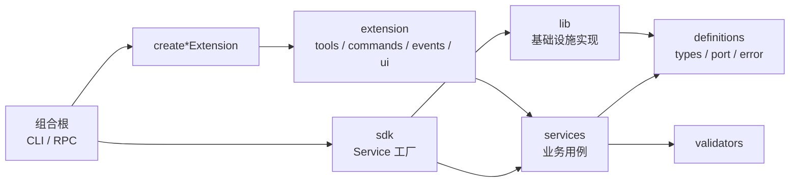

# Agent Inline Extension 开发指南

本目录存放 Octopus 内置 Pi 扩展。内置扩展由 CLI、RPC 等组合根通过 `extensionFactories` 显式装配，不依赖 Pi 对用户目录或项目目录的自动发现。

本文以 `workspace`、`onboarding` 和 [`run-cli.ts`](../cli/run-cli.ts) 为当前参考。示例体现可复用约定，但目录必须按实际复杂度渐进拆分，不要求简单扩展复制完整结构。

## 核心原则

- `extension/` 是 Pi 适配层，只注册 tool、command、event 和 UI 等公开 surface。
- 业务规则放在 `services/`，不得依赖 `ExtensionAPI`、TUI、Session 或具体基础设施。
- 文件系统、网络、Pi Runtime 等实现放在 `lib/`，通过 `definitions/port.ts` 与业务层隔离。
- `sdk/index.ts` 负责创建 Service 和提供稳定的宿主调用入口，不实现业务规则。
- CLI、RPC 等组合根负责创建和共享实例，不在 extension adapter 中创建第二份需要共享的状态。
- 只使用仓库锁定版本 `@earendil-works/pi-coding-agent` 的公开导出，不导入包内部源码。
- 没有真实复用、替换或测试边界时，不创建空目录、空 port 或无意义 facade。

## 分层与依赖方向



依赖方向必须由外向内：

- `definitions/types.ts`：领域数据、命令输入、结果类型，不放基础设施接口。
- `definitions/port.ts`：Repository、Runtime、Provider、Service interface 等可替换端口。
- `definitions/error.ts`：需要跨层识别时定义稳定错误码和领域错误。
- `validators/`：可复用的输入与领域校验，不依赖 Pi UI。
- `services/`：状态转换、业务编排和用例；只依赖 definitions、validators 和注入的 port。
- `lib/`：port 的具体实现以及文件、网络、锁、路径等基础设施能力。
- `sdk/index.ts`：装配默认基础设施并创建 Service；名称使用 `create<Name>Service`，不额外制造同义的 `create<Name>SDK`。
- `extension/`：把 Pi 的参数、上下文和返回契约适配到 Service。
- 扩展根 `index.ts`：只暴露需要公开的 SDK、命名工厂和默认 extension。

`services/` 不得导入 `extension/` 或 Pi API；`sdk/` 不得反向依赖 `extension/`；`lib/` 不得承载本应由 Service 管理的业务状态转换。

## 推荐目录和文件命名

```text
packages/agent/src/extensions/<name>/
├── index.ts
├── definitions/
│   ├── types.ts
│   ├── port.ts
│   └── error.ts             # 按需
├── services/
│   └── <name>-service.ts
├── validators/
│   └── <name>-validator.ts  # 按需
├── lib/
│   └── ...                  # port 实现和基础设施
├── sdk/
│   └── index.ts
└── extension/
    ├── index.ts
    ├── commands.ts          # 一个或多个用户命令
    ├── tools.ts             # 一个或多个模型工具
    ├── events.ts            # 生命周期/管线事件，按需
    ├── ui.ts                # 交互流程或复杂 UI，按需
    └── utils.ts             # adapter 共享的纯辅助函数，按需
```

命名规则：

- 文件名使用 kebab-case；surface 聚合文件统一使用复数 `commands.ts`、`tools.ts`、`events.ts`。
- 注册函数使用 `register<Name>Commands`、`register<Name>Tools`、`register<Name>Events`。
- Service 工厂使用 `create<Name>Service`，extension 工厂使用 `create<Name>Extension`。
- tool 名称使用稳定的 snake_case，例如 `workspace_current`、`octopus_model_status`。
- command 注册名不包含 `/`；用户调用时 Pi 自动表现为 `/workspace`、`/setup`。
- `extensionFactories[].name` 使用稳定的 `octopus-<name>` 命名空间。

简单扩展可以从单个 `index.ts` 开始；只有 adapter 出现多种 surface、共享业务规则或基础设施边界时再逐层拆分。

## Extension 入口规则

`extension/index.ts` 只组合注册函数，不解析命令、不实现业务流程、不直接读写文件：

```ts
import { registerExampleCommands } from './commands.js';
import { registerExampleEvents } from './events.js';
import { registerExampleTools } from './tools.js';
import { createExampleService } from '../sdk/index.js';
import type { ExtensionAPI } from '@earendil-works/pi-coding-agent';
import type { ExampleService } from '../services/example-service.js';

const defaultService = createExampleService();

export function createExampleExtension(service: ExampleService = defaultService) {
  return function exampleExtension(pi: ExtensionAPI): void {
    registerExampleEvents(pi, service);
    registerExampleCommands(pi, service);
    registerExampleTools(pi, service);
  };
}

export default createExampleExtension();
```

默认导出保证 extension 可以独立加载和冒烟测试；命名工厂允许组合根注入共享 Service。默认 Service 的创建只能构造轻量对象，不能在模块加载或工厂阶段启动进程、连接、watcher 或 timer。

扩展根入口保持简洁：

```ts
export * from './sdk/index.js';
export { createExampleExtension } from './extension/index.js';
export { default } from './extension/index.js';
```

内部 port、lib 和 adapter helper 默认不从根入口导出，除非它们属于明确的公共契约。

## 组合根与实例共享

[`run-cli.ts`](../cli/run-cli.ts) 是实例生命周期的最终决定者：

```ts
const workspaceService = createWorkspaceService();

await runPiCli(piArgs, {
  extensionFactories: [
    {
      name: 'octopus-onboarding',
      hidden: true,
      factory: createOnboardingExtension(),
    },
    {
      name: 'octopus-workspace',
      hidden: true,
      factory: createWorkspaceExtension(workspaceService),
    },
  ],
});
```

- 宿主在启动 Pi 前也需要使用某 Service 时，由宿主创建并注入同一实例；Workspace 属于这种情况。
- Service 只由 extension 使用且默认装配足够时，可直接调用无参 `create<Name>Extension()`；Onboarding 属于这种情况。
- `hidden: true` 表示 Octopus 管理的内置扩展，不作为用户安装的普通扩展展示。
- `extensionFactories` 中的 `name`、tool 名、command 名和持久化 `customType` 一旦发布应视为稳定标识。
- 工厂只同步注册能力。长生命周期资源在 `session_start` 或首次使用时创建，并在 `session_shutdown` 中幂等释放。

## Pi Surface 拆分规则

| 用户意图                    | Pi surface             | 文件          | 主要约束                            |
| --------------------------- | ---------------------- | ------------- | ----------------------------------- |
| 模型自主调用结构化能力      | `pi.registerTool()`    | `tools.ts`    | 精确 schema、稳定结果、传递取消信号 |
| 用户显式执行操作            | `pi.registerCommand()` | `commands.ts` | 防御性解析、清晰用法、可行动错误    |
| 观察或介入生命周期/管线     | `pi.on()`              | `events.ts`   | 使用最窄事件、不要假定独占处理链    |
| 交互式选择、输入或自定义 UI | `ctx.ui`               | `ui.ts`       | 先检查 `ctx.hasUI`，提供非交互降级  |
| adapter 间共享格式化和解析  | 普通函数               | `utils.ts`    | 保持轻量，不复制 Service 业务规则   |

Tool 是模型权限边界。模型不应自主执行的 mutation 优先放到 command 或宿主 API，不要仅为了复用而注册 tool。

## Command 开发规则

- 一个扩展的命令集中在 `commands.ts` 注册；多个子操作优先设计为一个稳定主命令，例如 `/workspace current|list|create`。
- `description` 应包含用途或简短 usage，错误信息应告诉用户下一步怎么做。
- 对参数执行 `trim`、默认值、未知子命令和缺失参数检查；复杂解析提取到 `utils.ts` 或 validator。
- 仅对廉价、确定且不泄露敏感信息的数据提供 `getArgumentCompletions`。
- 命令需要交互时必须检查 `ctx.hasUI`。非 TUI、print、JSON 和 RPC 模式下应明确报错、接受显式参数或安全跳过展示。
- 仅展示结果时，通过带 `ctx.hasUI` 防护的 helper 调用 `ctx.ui.notify`；关键业务结果不能只存在于 UI 中。
- command adapter 捕获错误时输出简洁、可操作的信息；领域错误码和详细原因保留在内层。
- 使用 `ctx.cwd` 获取当前工作目录，不使用可能变化的 `process.cwd()`。

注册示例：

```ts
export function registerExampleCommands(pi: ExtensionAPI, service: ExampleService): void {
  pi.registerCommand('example', {
    description: 'Usage: /example current | create <name>',
    handler: async (args, ctx) => {
      const command = parseExampleCommand(args);
      const result = await service.execute(command);
      notifyExampleResult(ctx, formatExample(result));
    },
  });
}
```

## Tool 开发规则

- 使用 TypeBox 声明精确参数，并设置 `{ additionalProperties: false }`。
- `name`、`label` 和 `description` 必须稳定清晰；description 应说明只读、mutation、约束和返回语义。
- `execute` 返回一致的 `content` 与 `details`；当前 Pi 0.84.3 的 `AgentToolResult` 没有 `isError` 字段，失败应抛出安全错误，由 Pi 生成原生 tool error，不能把失败包装成成功文本。
- 将 Pi 提供的 `AbortSignal` 传到 Service 和下游网络、文件或进程操作，不吞掉取消。
- 对输出设置合理边界，不返回凭证、完整内部日志或敏感上下文。
- 默认假设 tool 会并行执行；共享 mutation 必须串行化、加锁或具备冲突控制。
- renderer 只负责展示，必须同步且轻量，重要结果仍需存在于文本 `content` 中。

## Event、Session 与状态规则

- 事件集中放在 `events.ts`，注册函数只建立 handler，不在注册阶段执行长任务。
- 使用拥有该职责的最窄事件：初始化用 `session_start`，清理用 `session_shutdown`，完全稳定后的动作用 `agent_settled`。
- `session_start` 会在启动、切换、fork 或 reload 后再次发生；不要假定只调用一次。
- 关闭逻辑必须幂等：停止接受新任务、取消活动操作、关闭资源并清空引用。
- 闭包状态只属于当前 extension 实例；可恢复的 Session 状态使用版本化 custom entry；跨 Session 状态使用文件或外部存储。
- Session 替换后旧的 `pi`、context、session manager 和资源均视为失效。
- 涉及项目内容时遵守 Project Trust；状态展示失败可安全降级，权限门禁失败必须拒绝。

## 常用开发命令

在仓库根目录运行：

```bash
pnpm dev:agent
pnpm build:agent
pnpm --filter @octopus/agent test
pnpm --filter @octopus/agent lint
pnpm --filter @octopus/agent typecheck
pnpm format
```

聚焦迭代可以在 `packages/agent` 下运行：

```bash
pnpm exec tsc --noEmit -p tsconfig.json
pnpm exec eslint "src/extensions/<name>/**/*.ts"
pnpm build
node --test test/<name>.test.mjs
```

新增或修改 extension 后至少执行聚焦测试、lint 和 typecheck；提交前执行仓库级 `pnpm test`、`pnpm lint`、`pnpm typecheck` 与 `pnpm build`。需要验证真实 Pi 加载时，使用隔离配置进行冒烟测试，不修改用户正常的 Pi 设置。

## 测试与完成定义

测试按风险覆盖三层：

1. Service 单元测试：脱离 Pi 验证业务状态、校验、错误与恢复语义。
2. Extension 注册契约测试：使用最小 `ExtensionAPI` stub 验证 event、command 和 tool 的稳定名称。
3. 集成或冒烟测试：验证实际构建出口、至少一个 surface、非交互行为和相关生命周期转换。

涉及相应能力时还要覆盖成功、校验失败、依赖失败、取消、并发、Session 替换和重复 shutdown。

一个 InlineExtension 完成时应满足：

- `extension/index.ts` 只有组合代码，adapter 中没有第二套业务规则。
- Service 可脱离 Pi 测试，基础设施通过真实边界注入。
- 公共根入口不泄露内部实现，也不存在同义工厂或无意义 facade。
- CLI 与 RPC 等宿主获得一致业务语义，交互 UI 有确定的非交互降级。
- tool、command、event、factory 和持久化标识稳定且有命名空间。
- 取消信号能传递到下游，关闭后不遗留进程、连接、watcher 或 timer。
- 新增源码遵守仓库文件头、JSDoc、命名、格式化和测试规范。
